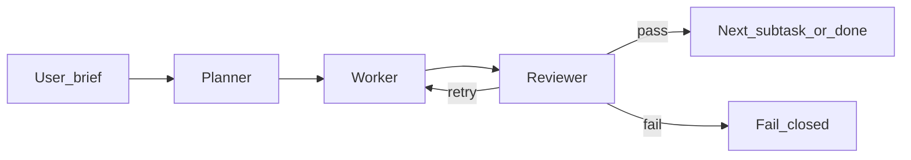

# AI role pipelines

Each AI Team role runs a fixed three-stage graph:

1. **Planner** (commercial API model) — decomposes a brief into bounded JSON subtasks  
2. **Worker** (local-remote or commercial profile) — executes one subtask at a time  
3. **Reviewer** (commercial API model) — returns `pass` | `retry` | `fail`; retries are capped  

## UI-managed models

Platform admins register profiles at `/admin/ai/models`:

- Company dropdown (OpenAI, Anthropic via OpenRouter, Google Gemini, Groq, …) autofills the chat-completions endpoint and filters models  
- Display name is what AI Team shows when picking Planner / Worker / Reviewer  
- Internal profile slug is generated server-side (not an API secret)  
- API key entered in the UI, encrypted at rest (`AI_MODEL_SECRETS_KEY` or `NEXTAUTH_SECRET`); never returned in full (last4 only)  
- Custom / self-hosted keeps freeform endpoint + model id for OpenAI-compatible hosts

Role bindings live per organization on `/workspace/ai-team` (managers edit Planner / Worker / Reviewer assignments).

## Runtime

`POST /api/projects/[id]/ai/pipeline/runs` runs the orchestrator sequentially under the shared dispatch lock and budget reservation (same family of gates as team chat). Stage events and dollar costs are stored on `AiPipelineRun` / `AiPipelineStageEvent`.

Fail closed when profiles, secrets, budgets, or JSON parsing are missing—never invent worker output.

IDE chat remains single-call until a later wire-up to this orchestrator.
